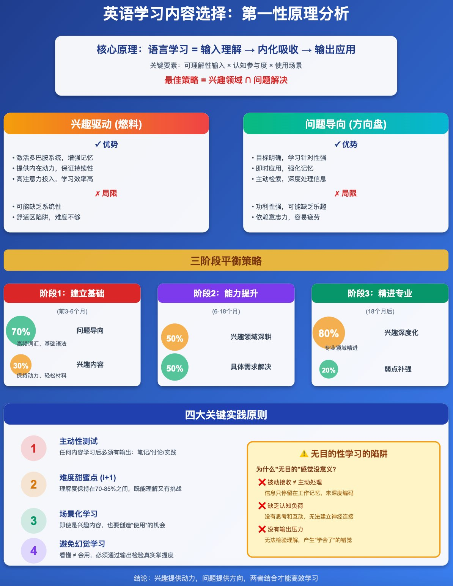

大家在学习英语的时候，有一个很大的问题，海量音视频内容以及不同层次的内容，该怎么选择

我来从第一性原理角度分析英语学习中的内容选择问题

核心理论：兴趣是燃料，问题是方向盘，两者缺一不可

然后具体学习的时候，你对照下是从哪个阶段开始的

## 第一性原理：语言学习的本质是什么？

语言学习的核心是建立"输入理解 → 内化吸收 → 输出应用"的循环。这个循环需要：

1. 可理解性输入 (Comprehensible Input) 2.认知参与度 (Cognitive Engagement) 3.使用场景 (Contextual Application)

## 从基本原理推导出的结论

1. 兴趣驱动的价值
   注意力是稀缺资源：大脑只有在专注时才能有效编码信息
   情感记忆增强：感兴趣的内容会激活多巴胺系统，增强记忆固化
   持续性保障：兴趣提供内在动力，避免意志力耗竭
2. 问题导向的价值
   目标明确性：问题创造"信息缺口"，大脑主动寻求填补
   即时反馈：解决问题后立即获得成就感，强化学习行为
   应用场景：问题本身就是使用场景，学以致用
3. "无目的性"内容的真相 你感觉的"没有意义"是对的，因为：
   被动接收 ≠ 主动处理：看/听不等于学习
   缺乏认知负荷：没有思考和互动，信息仅停留在工作记忆
   没有输出压力：无法检验是否真正理解

## 最优策略框架

核心原则：兴趣是燃料，问题是方向盘
最佳学习模式 = 兴趣领域 ∩ 问题解决

## 具体实施

阶段1：建立基础

1.  70% 问题导向：针对性学习高频词汇、基础语法
2.  30% 兴趣内容：保持动力，轻松材料

阶段2：能力提升

1.  50% 兴趣为主：在感兴趣领域深度浸泡
2.  50% 问题导向：针对工作/学习的具体需求

阶段3：精进阶段

1.  80% 兴趣驱动：深度专业化
2.  20% 弱点补强：针对性解决短板

## 关键实践原则

主动性测试：任何内容学习后，必须有输出（笔记/讨论/应用）
难度甜蜜点：i+1原则，理解度在70-85%之间
场景化学习：即使是兴趣内容，也要创造"使用"的机会
避免幻觉学习：看懂 ≠ 会用，必须检验

## 结论

1. 不要二选一：兴趣是燃料，问题是方向盘，两者缺一不可
2. 你的直觉是对的："无目的性"学习效率低，因为缺乏主动认知参与
3. 最佳实践：在你感兴趣的领域内，设定具体问题去解决（比如：喜欢篮球→用英语分析NBA战术；喜欢编程→读英文技术文档解决bug）

关键是：任何内容学完后，必须有输出动作（写总结、教别人、实际使用），否则就是幻觉学习

