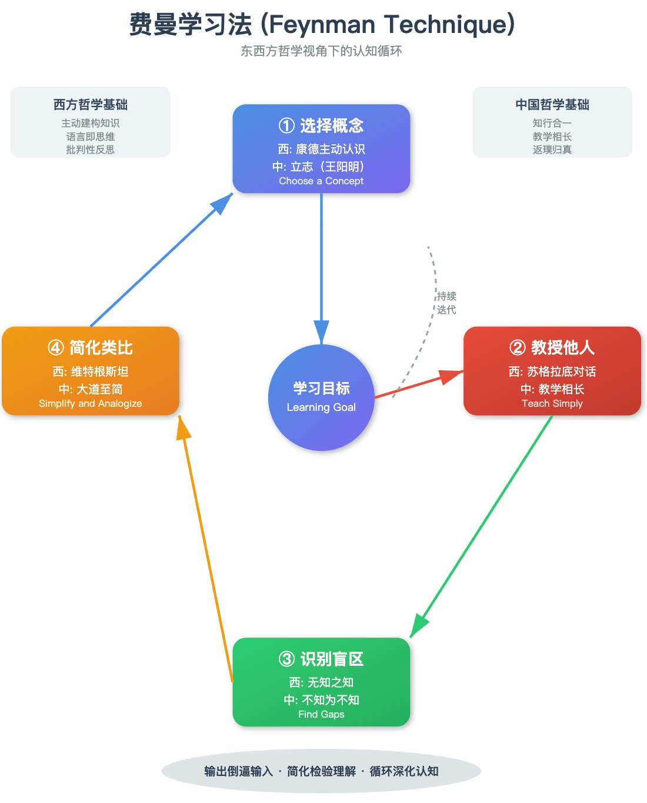

## 西方哲学视角

### 1. **苏格拉底式对话法**

费曼学习法的核心——通过教学来检验理解——与苏格拉底的"精神助产术"异曲同工。当你尝试用简单语言解释概念时，你在进行自我诘问：

- "我真的理解了吗？"
- "这个解释有漏洞吗？"

这种方法揭示了**无知之知**——只有在教学过程中，我们才意识到自己理解的边界。

### 2. **康德的主动认识论**

康德认为知识不是被动接收，而是主动建构。费曼学习法要求学习者：

- **主动重组**知识结构（类比、简化）
- **综合判断**新旧知识的联系
- 通过"先验范畴"（已有认知框架）整合新信息

### 3. **维特根斯坦的语言哲学**

"**能说清楚的就能想清楚**"。费曼学习法强制将内隐知识外显化：

- 无法用简单语言表达 = 理解不透彻
- 语言的清晰度反映思维的清晰度

## 中国哲学视角

### 1. **《论语》："学而时习之，温故而知新"**

- **学（输入）→ 习（实践）→ 教（输出）** 形成完整循环
- "教学相长"：通过教授他人来深化自己的理解
- "知之为知之，不知为不知"：直面知识盲区

### 2. **道家的"返璞归真"**

费曼强调用**最简单的语言**解释复杂概念，类似于：

- **大道至简**：真理往往以最简洁的形式存在
- **去伪存真**：剥离术语包装，还原本质
- 老子："为学日益，为道日损"——学习是做加法，理解是做减法

### 3. **王阳明的"知行合一"**

- **知**（理解概念）必须通过**行**（教授他人）来验证
- 真正的"致良知"需要在实践中检验
- "未有知而不行者，知而不行，只是未知"——不能教授=未真正理解

### 4. **禅宗的"不立文字，直指人心"**

费曼学习法要求**跨越术语障碍**，用日常语言解释：

- 类似禅宗要求透过概念看本质
- 比喻、类比的使用 = 禅宗的"棒喝"与"公案"
- 教学过程是一种"顿悟"的触发机制

---

## 核心哲学共识

无论东西方，费曼学习法都体现了：

1. **知识的主体性**：学习者是主动建构者，非被动容器
2. **实践检验真理**：理解需要通过"输出"来验证
3. **简化即深化**：能化繁为简是理解深度的标志
4. **反思性认知**：通过元认知（思考自己的思考）来提升学习

