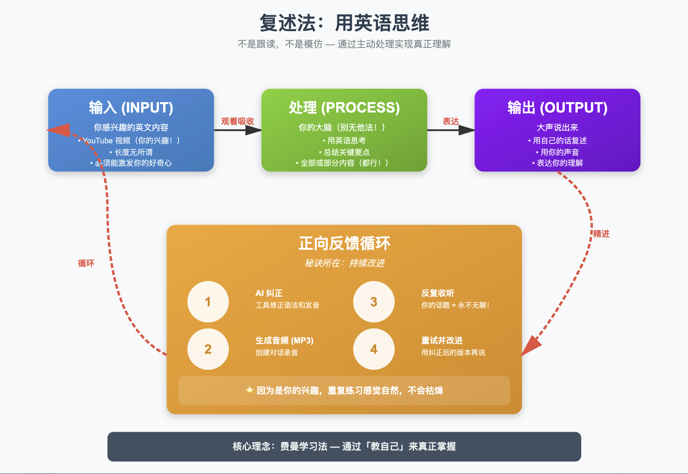
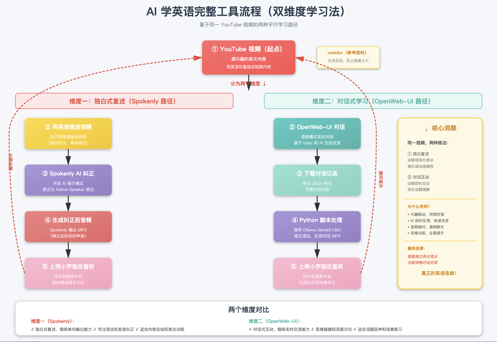

核心概念是retelling，简单来说是input-process-output，它不是简单的shadowing去mimic别人的东西，而是真正的thinking english in mind，通过英文内容的输入用自己的脑子思考总结后表达出来的过程，感觉也算是费曼学习法，大道至简，殊途同归啊

输入内容：一定，一定，一定，重要的事说三遍，是你感兴趣的英文视频内容，多长无所谓，但建议不要太长
处理过程：无他，your brain。就是你自己在看几遍后能够总结下来的英文内容，不见得非得是所有内容，一部分内容也行
输出内容：你能够用嘴说出来的英文

nb，你讲出来，ipo就完成了，然后觉得这么easy，可以洗洗睡了，看来这小子的方法也挺low啊

嗯，确实不是很高明，但是得知道自己讲得o不ok，不ok，那纠正后的内容需要反复听，形成positive feedback。反正是自己感兴趣的topic，多听听也不会觉得boring

本地用到的工具：ollama、openweb-ui、docker、spokenly、模型llama3.1:8b

