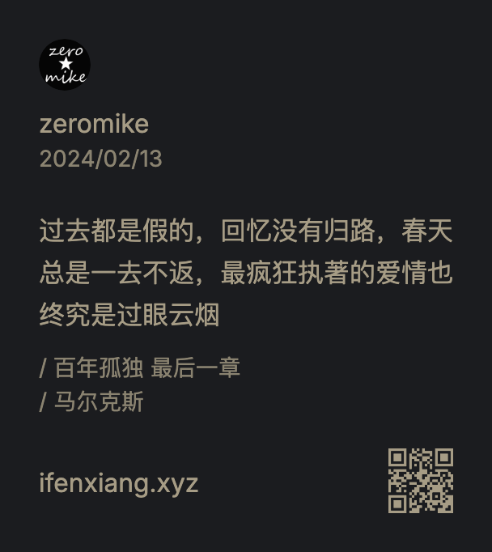

我做了一个微信读书分享的卡片工具，https://www.ifenxiang.xyz



## 为什么要做

我平时有阅读的习惯，除了使用微信读书之外，还订阅了很多博客  
我经常希望将一些触动自己的内容分享出来，微信读书分享的卡片样式是我喜欢的风格

```
分享元素：分享人头像、分享人名称、分享时间、分享内容、书名和章节、作者、以及分享内容的二维码
```

这些元素将谁在什么时间在什么地方做了什么事情完全涵盖了，是一个完整的share story  
网上有很多的APP或者网站做很漂亮的分享卡片，我没有找到微信读书风格的，这是我为什么要做的初衷

## 创建过程

微信读书分享卡片是个纯前端的项目

### 1. 产品功能

这个分享工具功能上不复杂

1. 本地头像预览
2. 分享内容输入
3. 时间选择器
4. 下载图片
5. copy图片

### 2. 技术栈

用vite生成了一个react项目，其他用了shadcn、tailwind、react-icons、html2canvas、qrcode.react

除了vite和react技术之外，其他工具我都是第一次用，先是粗略看了遍文档，了解了它们的能力，和我要做的功能是可以匹配的，我就边看文档边上手做了

本地头像预览用的FileReader、下载图片a标签、copy图片用的原生ClipboardItem，图片生成html2canvas

其他组件使用shadcn的官方文档的例子粘过来稍微改一下

### 3. 移动端适配

第一版是纯PC版的，我照着tailwind官方文档把页面拼了出来，然后我想了想平时在外面用手机分享不方便，就适配了一下手机端，在适配PC和手机端的时候，用了一下chatGPT做了下布局，chatGPT3.5完全够用了

### 4. 购买域名

在 https://www.dynadot.com/ 买了域名，现在使用的是ifenxiang.xyz，买个最便宜的1.99dollars一年，把币种换一下，可以使用银联、支付宝购买，我用的支付宝买的，会有汇率换算

### 5. 项目部署

用的vercel部署的

1. 代码托管：把代码推到github上，设置成了private
2. 账号授权：登录vercel后授权github账号权限，只授权部署的项目即可
3. 部署：按照部署步骤构建部署就行了，vercel部署实在是太特么的简单了
4. 绑定域名：部署完了，用vercel的域名preview一下，没什么问题，就把买的域名绑定到vercel里，把cname设置到dynadot里等几分钟，vercel会一直refresh状态，状态正常后，用你的域名访问正常就完成了构建部署
5. 统计：虽然vercel提供了分析工具，我感觉分析信息比较少，我也不愿意花钱，就选了个baidu的，免费版肯定是够用了

### 6. 总结

我们回顾一下create和deploy这个工具的成本  
时间成本：几个小时  
资金成本：1.99dollars/year  
代码托管、静态资源托管、统计工具完全免费

所以我们看，在create一个项目的时候，需要的成本并不是很高，当然这里还没有用到账号、存储、付费链路，如果加上的话，除了增加时间成本外，资金成本上也是很低的，因为国外有很多云产品是有for独立开发者的免费额度，大部分情况下足够使用了

## 下一步

打通一个小生意的链路

1. 功能：登录、付费功能、账号管理、付费链路、反馈渠道

2. 运营：谷歌 seo；虽然这个工具价值有限，但还是希望能够服务一些用户，在这个过程中学习一些推广和销售的方法，也希望能够认识更多的人

## 独立开发思考

独立开发者，被成为indiehacker，国外有很多，国内现在也不少了。我觉得对这个的定义应该是个体户软件服务商，作为软件服务商应该具备以下几个环节：识别需求、固定需求、产品设计、技术方案、创建产品、销售产品、运营产品，得到用户反馈后再迭代产品

大部分程序员对技术方案和创建产品有掌控力，其他环节几乎都是薄弱环节

有两种典型的产品失败的case:

1. 产品需求纯属闭门造车，花大力气创造出来，解决不了真实的用户问题

2. 产品创造出来了，不知道如何去销售和运营，觉得等着用户来就行了

我的想法是即便把软件服务商的各环节都打穿，也不见得这个产品有用户埋单，但是你这些环节根本不去思考和补足，那产品注定是失败的

独立开发赚钱是很困难的，想靠这个挣到钱的也是凤毛麟角，我在X和podcast上了解到的最简单的挣钱方式就是找个工作上班赚钱

我们在职场打工，职场有它的游戏规则，打工者的评价标准是公司从经营角度设定的，我觉得做独立开发者或者创业更多的是想将对自己的评价掌握在自己手里

我认为独立开发和独立思考一样，它给人带来的思想上的提升是立体的，对问题的思考也非单纯的因果关系

不想随波逐流，不想做”二八原则“中的八，我认为这是一种作为个体在世界上立足的价值观

## 找到我

喜马拉雅、小宇宙、Apple Podcasts、Snipd、listennotes 搜索大话前端
