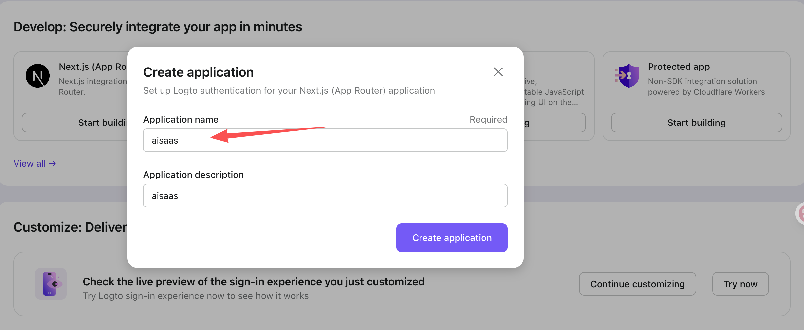
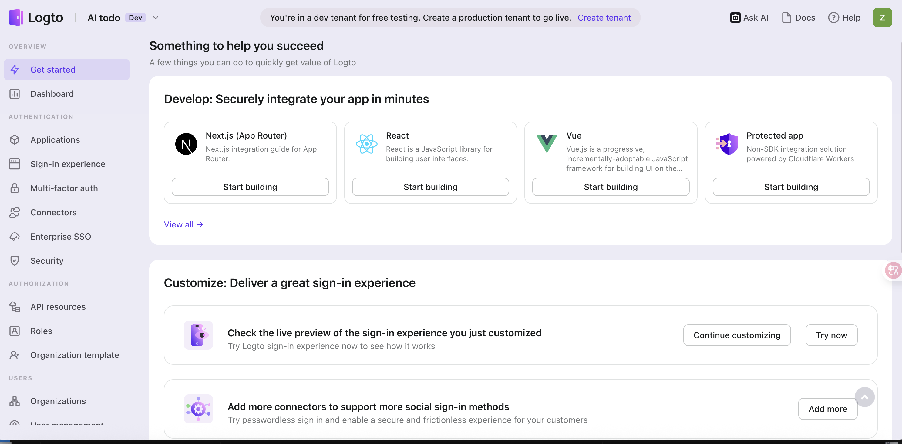
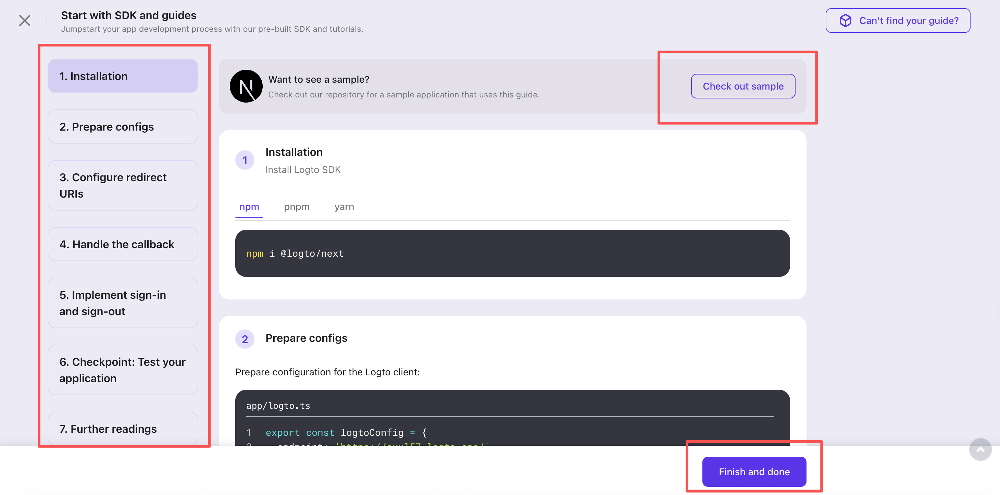
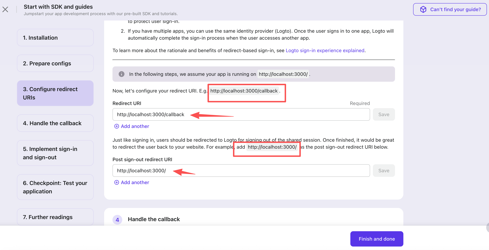
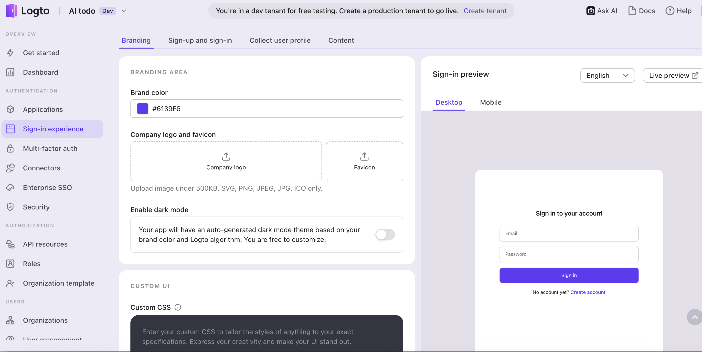
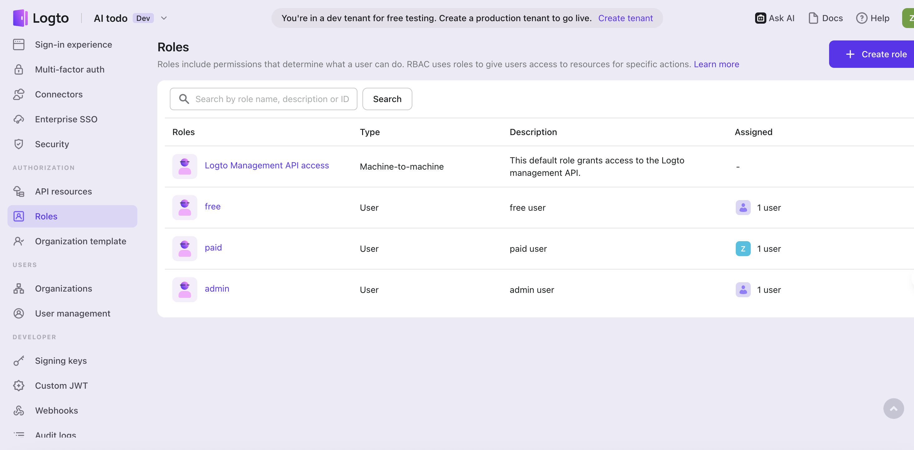
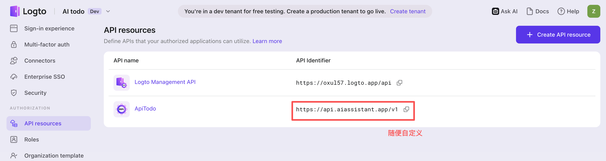

最近自己在通过Learning by doing 出海的技术栈和云产品，我当前在本地开发一个SAAS项目

## 技术栈

monorepo的前后端项目  
**前端**  
typescript、react19、next.js15、shadcn、tailwindcss4、ai-sdk、ai-elements  
**后端**  
nest.js、drizzle、postgres、typescript  
**AI服务**  
mcp服务: @modelcontextprotocol/sdk  
模型服务：ollama qwen2:1.5b

## 当前状态

landing页面、基本的crud功能、ai chatbot的交互都完成了

这时候需要一个用户登录与鉴权的能力了，我之前开发的一个卡片应用 用的是clerk，最近看X上有人一直在推荐better-auth，我就想顺便了解下当下都有哪些开源免费的身份访问管理的产品，于是调研(AI助手调研🐶)了Logto、better-auth和clerk的能力

### Logto 与 Better-Auth.js、Clerk 的对比及区别

Logto 是一个开源的身份和访问管理 (IAM) 平台，支持 OIDC、OAuth 2.0 和 SAML 2.0 等协议，可自托管或使用其云服务。它针对现代应用和 SaaS 设计，提供全面的用户认证、授权和多租户支持。相比 Better-Auth.js（一个轻量级的自托管认证库）和 Clerk（一个托管的认证服务平台），Logto 的定位更接近于一个完整的开源 IAM 系统，类似于 Auth0 的开源替代，但更注重灵活性和成本控制。以下是三者的详细对比，基于功能、部署、定价、优缺点，以及对 startup（尤其是无用户、低成本项目）的适用性。

#### 主要特点对比

使用表格总结核心区别：

| 方面         | Logto                                                                                                                                             | Clerk                                                                                        | Better-Auth.js                                                                      |
| ------------ | ------------------------------------------------------------------------------------------------------------------------------------------------- | -------------------------------------------------------------------------------------------- | ----------------------------------------------------------------------------------- |
| **部署模式** | 开源自托管（免费）或云托管（Logto Cloud）                                                                                                         | 纯云托管，无需维护服务器                                                                     | 自托管库，集成到你的应用中（无独立服务器）                                          |
| **核心功能** | 用户认证（密码、社交、SSO）、MFA、RBAC、多租户（Organizations）、API 保护、审计日志、SAML/OIDC 支持；SDK 支持多种框架（如 Next.js、React、Go 等） | 用户认证、社交登录、2FA、多租户（Organizations）、预构建 UI 和仪表板、Billing 与 Stripe 整合 | 用户认证、社交登录、2FA、速率限制、插件扩展；框架无关，主要针对 TS/JS（如 Next.js） |
| **适用场景** | B2B/B2C SaaS，需要企业级 IAM 和灵活自定义；适合从简单到复杂的扩展                                                                                 | 快速原型和 MVP，需要开箱即用 UI 和托管；适合 React/Next.js 项目                              | 简单认证需求，需要完全数据控制和零成本；适合小型到中型应用                          |
| **扩展性**   | 高，支持外部生态集成（如 M2M 认证、第三方 OAuth）；可作为身份提供者                                                                               | 中等，强于开发者体验，但自定义受限                                                           | 中等，通过插件扩展，但不如 Logto 全面                                               |
| **安全性**   | 企业级（SOC2 准备、暴力破解保护、审计日志）                                                                                                       | 高，托管式安全，但数据在云端                                                                 | 基本到中等，依赖你的实现                                                            |

#### 定价对比（针对 startup 无用户阶段）

- **Logto**：自托管完全免费。云版免费计划支持高达 50,000 月活跃用户 (MAU) 和 50K 令牌；Pro 计划 $24/月起（包含 RBAC、MFA、SSO），额外令牌 $0.08/100。 对于无用户项目，几乎零成本，且免费层上限高，适合早期增长。
- **Clerk**：免费计划支持 10,000 MAU 和 100 月活跃组织 (MAO)；Pro 计划 $100/月起 + $0.02/额外 MAU。开发模式下功能免费，但增长后成本上升。
- **Better-Auth.js**：完全免费开源，无任何直接费用；潜在成本仅为你的数据库/服务器（可使用免费云层，如 Vercel 免费计划）。

Logto 的云定价更亲 startup（更高免费 MAU 阈值），而 Clerk 可能在早期免费，但扩展时更贵。Better-Auth 则是零风险免费。

#### 优缺点对比

**Logto 的优点**（相对于其他两个）：

- 开源免费核心功能，避免供应商锁定；所有企业级特性（如 SSO、RBAC、多租户）免费可用，而非像 Clerk 那样需付费升级。
- 更全面的协议支持（SAML 等），适合 B2B 场景；可作为身份提供者，支持联邦身份管理。
- 开发者友好：丰富 SDK 和文档，社区活跃；云版提供托管便利，但保留自托管选项。
- 成本效益高：免费层 MAU 上限是 Clerk 的 5 倍，适合 startup 快速增长而不担心费用。

**Logto 的缺点**：

- 设置较复杂（尤其是自托管），需管理数据库和配置；重定向式认证可能不适合某些无缝体验需求（但有嵌入组件缓解）。
- 社区较小（相比成熟托管服务），B2E 功能（如 LDAP 同步）暂不完整。
- 与 Better-Auth 比，Logto 更重型，可能过度于简单项目。

**与 Clerk 的区别**：

- Logto 强调开源和灵活性（可自托管，避免数据锁定），而 Clerk 专注易用性和托管（预建 UI、快速集成）。Logto 适合需要自定义或长期成本控制的 startup；Clerk 更适合时间紧迫、优先 MVP 的项目。 Logto 的免费层更慷慨，但 Clerk 的仪表板和 Billing 整合更无缝。

**与 Better-Auth.js 的区别**：

- Logto 是完整的 IAM 系统，支持多协议和多租户，而 Better-Auth 是轻量库，专注认证而不包括高级 IAM（如 SAML）。Better-Auth 继承了 Auth.js 的优势（如无缝 Next.js 集成），但 Logto 更适合复杂场景。 如果你的项目简单，Better-Auth 更易上手；Logto 提供更多企业级扩展。

#### 作为 startup 的选择建议

项目刚起步、无用户、追求无费用或极低费用：Logto 是强有力的选项，尤其如果你计划扩展到多租户或 SSO。它自托管免费，云免费层覆盖早期所有需求（远高于 Clerk），让你专注开发而非基础设施。 如果需要预建 UI 和零配置，Clerk 仍是首选；如果偏好简单库和完全控制，选 Better-Auth。

Next.js 项目可试 Logto 的 SDK（有教程声称“优于 Clerk”）。 建议从 Logto 的免费云试用开始，如果不符再切换（数据导出类似 Clerk，支持 API/CSV）。如果需要付费管理细节，参考你的订阅模式（free/$10/$30/enterprise），Logto 可通过 metadata 或 RBAC 实现类似 Clerk 的账号分类。

## 我的选择

我不想自己部署，所以选择了Logto云服务做登录和用户管理，和clerk比较，配置差不多，地址：https://cloud.logto.io/

### Logto控制台配置

因为我的技术栈是next.js，在get started的时候，会让你选择技术栈，除非你用的十分偏门的技术，正常主流的技术栈都有指导，我用的next.js15，支持server-action，选择技术栈开始创建，按照步骤一个个看和填就行，如果你已经有了next.js的项目，端口是3000，就是配置两个推荐的redirect地址即可





### next.js代码配置

把界面上提供的代码copy到你的next.js项目就行，但是appId等一些敏感信息，最好自己配置到.env中

```.env
# Logto 认证配置

# ========================================

# Logto 服务端点

LOGTO_ENDPOINT=logto提供的

# Logto 应用 ID

LOGTO_APP_ID=logto提供的

# Logto 应用密钥

LOGTO_APP_SECRET=logto提供的

# 应用基础地址

LOGTO_BASE_URL=http://localhost:3000

# Cookie 密钥 (32位随机字符串)

LOGTO_COOKIE_SECRET=logto提供的

# Cookie 安全模式 (生产环境自动启用)

LOGTO_COOKIE_SECURE=false

# Logto 资源地址 api resouce地址
LOGTO_RESOURCE=https://api.aiassistant.app/v1
```

### 自定义登录界面

默认不用配置



### 角色配置



通过以上几步的操作你就可以本地登录了，登录的时候用邮箱注册即可，流程还是很简单的

有什么不懂的，点击右上角那个【ASK AI】的按钮问文档，中文问，回答的也是中文，挺friendly，唯一缺点你刷新页面后，它的对话没有history记录

和clerk比较，clerk提供了用户信息管理的react组件，Logto需要自己写个用户信息展示

## 注意点

如果想使用角色来区分身份，比如free、paid会员以及管理员身份，默认的角色信息是不会给你的，这样你是无法从入口区分用户等级的，需要做个配置

1. api resource配置，这个地址你随便自定义就行，你有点懵逼就用我提供的
2. logtoConfig中配置scopes，并加上Roles的配置



```ts
import { UserScope } from "@logto/next";

function getRequiredEnv(key: string): string {
  const value = process.env[key];
  if (!value) {
    throw new Error(`Missing required environment variable: ${key}`);
  }
  return value;
}

export const logtoConfig = {
  endpoint: getRequiredEnv("LOGTO_ENDPOINT"),
  appId: getRequiredEnv("LOGTO_APP_ID"),
  appSecret: getRequiredEnv("LOGTO_APP_SECRET"),
  baseUrl: getRequiredEnv("LOGTO_BASE_URL"),
  cookieSecret: getRequiredEnv("LOGTO_COOKIE_SECRET"),
  cookieSecure:
    process.env.NODE_ENV === "production" ||
    process.env.LOGTO_COOKIE_SECURE === "true",
  resources: [getRequiredEnv("LOGTO_RESOURCE")],
  scopes: [UserScope.Roles], // 需要把Roles配置到这里，你才能从claims里获取到
};
```

```ts
import { getLogtoContext } from '@logto/next/server-actions';
import { logtoConfig } from './logto';

export default async function HomePage() {
  // eslint-disable-next-line @typescript-eslint/no-unused-vars
  const { isAuthenticated, claims} = await getLogtoContext(logtoConfig);

  console.log('claims....', claims,claims?.roles);

  return (
    <div className="max-w-7xl mx-auto px-4 sm:px-6 lg:px-8">
     welcome
    </div>
  );
}
```

## 后续流程

1. stripe接入
2. blog菜单以及blog系统的发布
3. next.js的multi-zones
4. 国际化
5. 构建、部署
6. 日志服务接入
7. 监控服务接入
