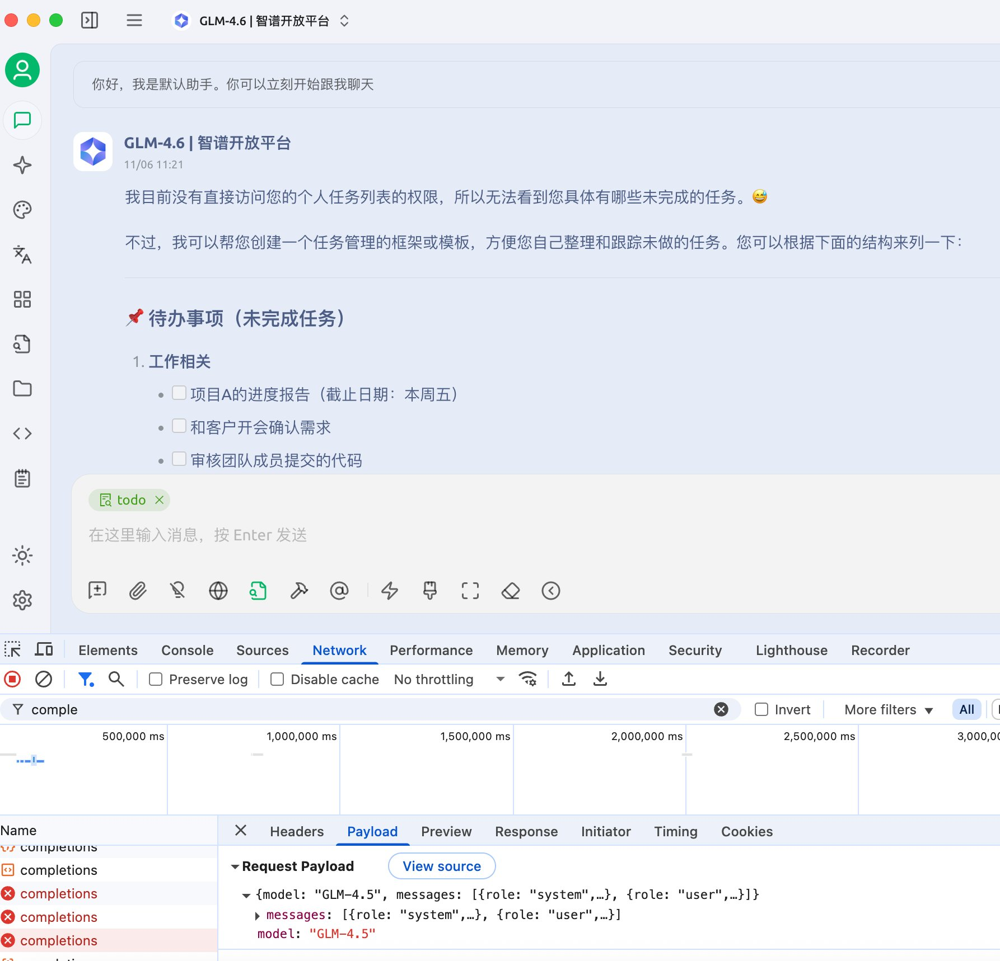
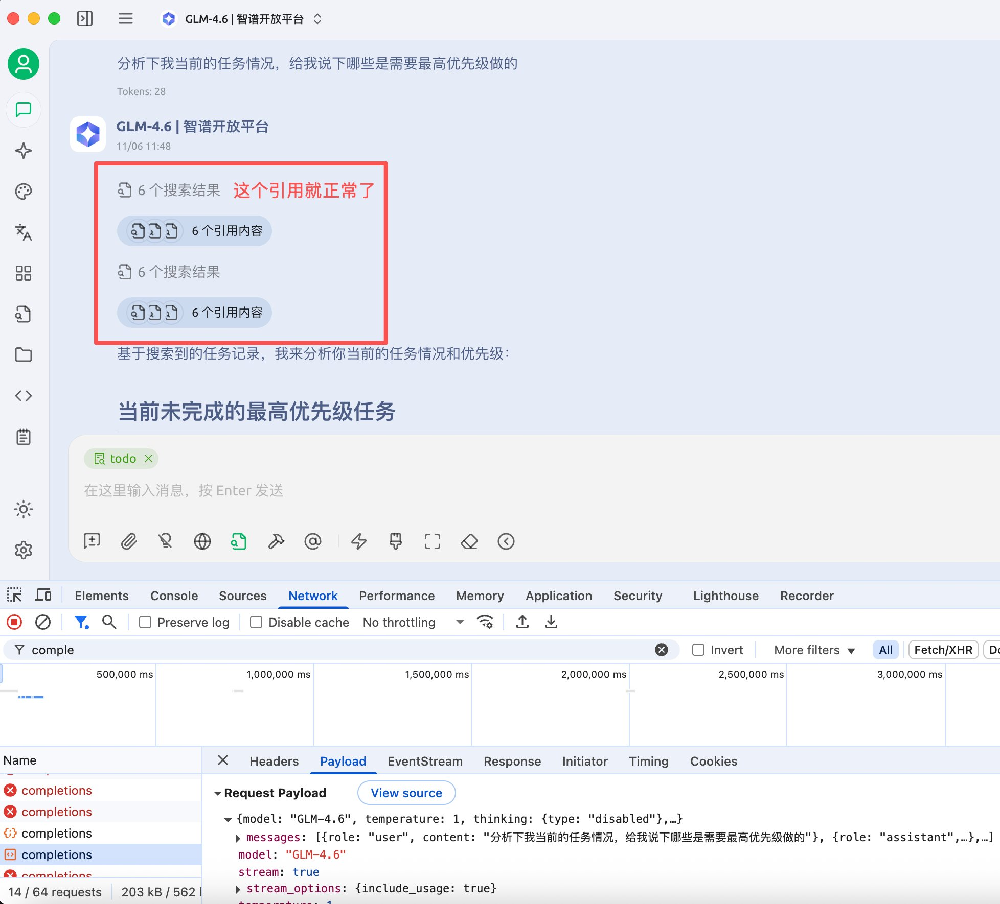

我一直想用AI来帮忙管理我每天的工作任务，特别是基于时间管理四象限法来整理任务，很多时候一天里任务规划的太多，之前未完成的任务级别一直在往紧急重要调整，还有很多要完成的任务拖延太严重，最终导致越来越多的任务无法完成。平时我用Cherry Studio，能导出答案也能导入做成知识库。于是，我计划了一个workflow：在Obsidian中每天创建一个Markdown文件，记录当天的Todo列表，然后将整个每日Todo目录导入到Cherry Studio的知识库里。这样，我在cherry studio里利用AI基于这些数据帮我分析和优化任务

我之前用的是手动添加的GLM4.5模型，之前我也添加过知识库，它运行得很好。但10月31日到期后，我买了GLM4.6的资源包，删掉旧模型，然后手动添加了新模型。在新会话中测试GLM4.6，一切正常，能正常响应查询

问题从这里开始：当我尝试在会话中加上我的Todo知识库时，AI总是报错，说“我目前没有直接访问您的个人任务列表的权限，所以无法看到您具体有哪些未完成的任务”。这让我有点懵逼，因为知识库导入看起来很正常——我试着删掉几次再重新导入，有时候进度卡住，有时候顺利完成，但结果最终是成功的

我开始怀疑是不是嵌入模型出了问题。Cherry Studio的界面提示MinerU的免费额度500，我只有6、7个很少文字的markdown文档，应该够用，但为了保险，我去申请了MinerU的API Key，并配置到工具中。显示剩余额度“无限制”，我又刷新了知识库导入，再试一次——还是失败

这下我有点焦躁了，我看了官方文档没有这方面的case，加了discord看没什么人说话就又加了tg，看有人说话，就准备把问题描述发出来

但是我的习惯是，在发出去问题前，再自己过一遍整个操作和请求响应的流程，看看是不是自己导致的问题，别到时候因为自己的问题导致场面尴尬，所以我决定深入排查。我打开Cherry Studio的调试面板，在Network面板查看接口日志，发现报错信息：“余额不足或资源包不足”。我在想是不是嵌入模型的资源问题。我赶紧去GLM平台买了一个Embedding的资源包，重新导入知识库，然后测试——没想到还是不行！

我靠，我不死心，再次检查Network日志，这次仔细看细节：日志中请求参数显示的model居然是“GLM-4.5”！MD，原来是模型参数没更新，于是我把手动添加的GLM4.6删除掉，从Cherry Studio的模型管理入口正式添加上GLM4.6——终于成功了！现在，知识库能正常加载，AI可以帮我管理那些四象限任务了

这个过程消耗了我半个多小时，搞得我心烦意燥，我本地也起着openweb-ui，它也有知识库功能，本想着它如果ok我就弃掉cherry studio了，但是试了下，感觉不是很好，所以又返回来去排查问题了。我不确定是不是手动添加的GLM4.6没完全覆盖旧设置，但是从接口日志上看，确实参数是GLM-4.5

我差点进入那个经典名场面

朋友：你爱CherryStudio吗
我：爱过...呜呜呜...

现在是又爱了，哈哈

