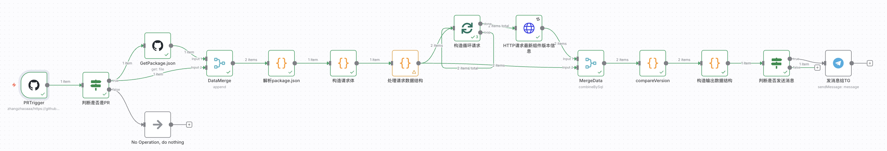
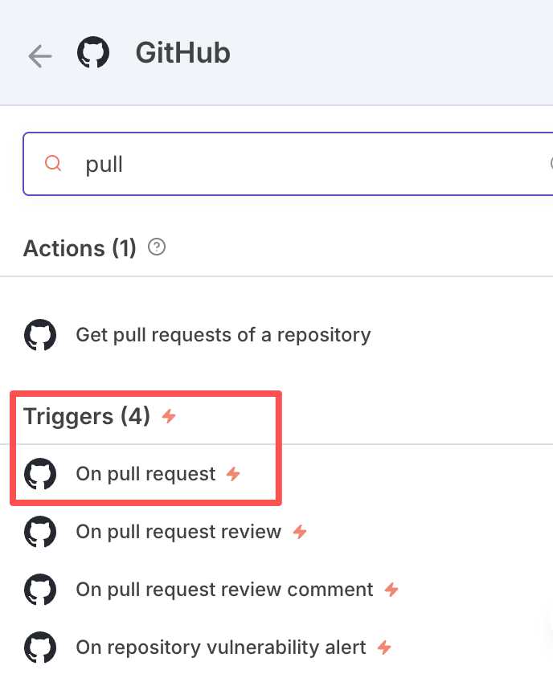
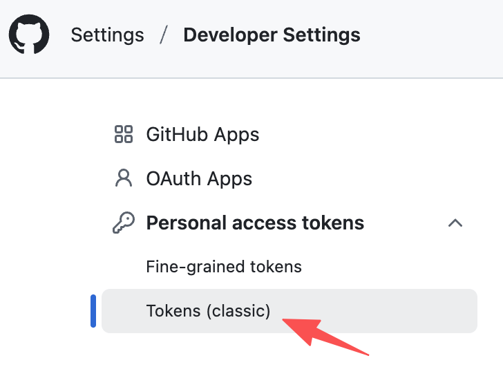
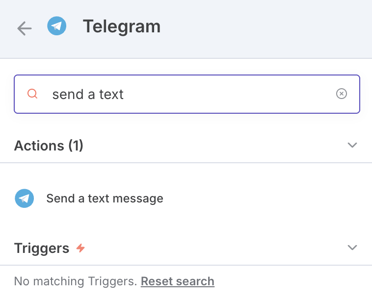

我本想用 n8n 把自动化提效这件事一把梭，结果被 Credentials 与触发器坑了两天。

## 目标

在本地做一个「PR 依赖版本对比并提醒」的自动化：

1. 配好 GitHub PAT
2. 在仓库里建 Webhook / 或 GitHub Trigger
3. 服务读取 webhook 数据并解析
4. 拉取仓库 `package.json` 与 npm 最新版本对比
5. 有更新则用 Telegram Bot 发送提醒

如果是自己写服务，半天就能完事；而用 n8n，Workflow 与 Credentials 的组合让我来回折腾。

## 核心经历与结论（TL;DR）

- Webhook 节点很顺，但一上 GitHub Trigger 就容易懵。
- 最大的坑：导入的 Workflow 里，新建的 Credentials 可能不生效，直接报 `Credentials not found`。
  - 解决：新建一个“从零创建”的 Workflow，再创建并绑定 Credentials，就能生效。
- 建议：把 n8n 当“编排器”，节点流转交给它；涉及较多逻辑/校验的地方仍然用代码服务承接。



## 技术点

1. 代理问题
2. n8n 节点选择
3. Credentials 问题
4. 数据流转问题
5. 发消息

### 代理问题

起步用 npx 启动的 n8n + Webhook 测试 GitHub 推送。公网到本地需要中转：

- 方案 A：ngrok（地址稳定，文档简单，适合持续调试）
- 方案 B：`--tunnel` 启动参数（n8n 临时给一个地址，重启会变，适合临时测试）

### n8n 节点选择

n8n 有现成的 GitHub Trigger：点击 + 号，搜索 GitHub，选择 Triggers 里的「On pull request」。



### Credentials 问题（最大坑）

1. 在 https://github.com/settings/tokens 创建 classic token（名称随意，repo/user/project 全选）。
2. 回到 n8n 新建 GitHub API 的 Credentials，填入账号与 token；连通性测试通过后尽量别在界面里反复修改（回显是加密的，常见“看起来不通”的错觉）。
3. 若运行时报 `Credentials not found`，而 curl 自测没问题，极大概率是「导入的 Workflow」绑定失败。
   - 解决：新建一个全新的 Workflow，重新创建并绑定 Credentials；或者在现有 Workflow 里重新选择并保存绑定。



### 数据流转问题

节点默认“只输出自己的数据”，有时会丢失上游上下文。遇到这种情况：

- 加一个 Merge 节点，把上游数据并入当前节点的输出，再往下传。
- 规则：能在节点里解决就别拼命写表达式，把上下文“显式带着走”。

### 发消息（Telegram）

1. 在 @BotFather 用 `/newbot` 创建机器人，拿到 Bot Token。
2. 在 n8n 找 Telegram 节点，选择「Send a text message」，创建 Telegram Credentials 并填入。
   
3. 获取 Chat ID：

```
使用 @userinfobot

在 Telegram 中找到 @userinfobot
发送任意消息
Bot 会回复你的 Chat ID
```

4. 先发最简单的文本，确保链路通，再逐步把内容做成 Markdown。

## 我的反思

- 能写服务的地方，不必强行在 n8n 里“写代码”。让 n8n 做流程编排/触发与集成，复杂逻辑交给代码服务。
- 导入的 Workflow 尤其要小心 Credentials 绑定；排错时优先“新建一个干净的 Workflow”做对照实验。
- 文档和 AI 都要用，但 n8n 的官方「Chat with the docs」比通用大模型更贴边，问题能更快落地。
