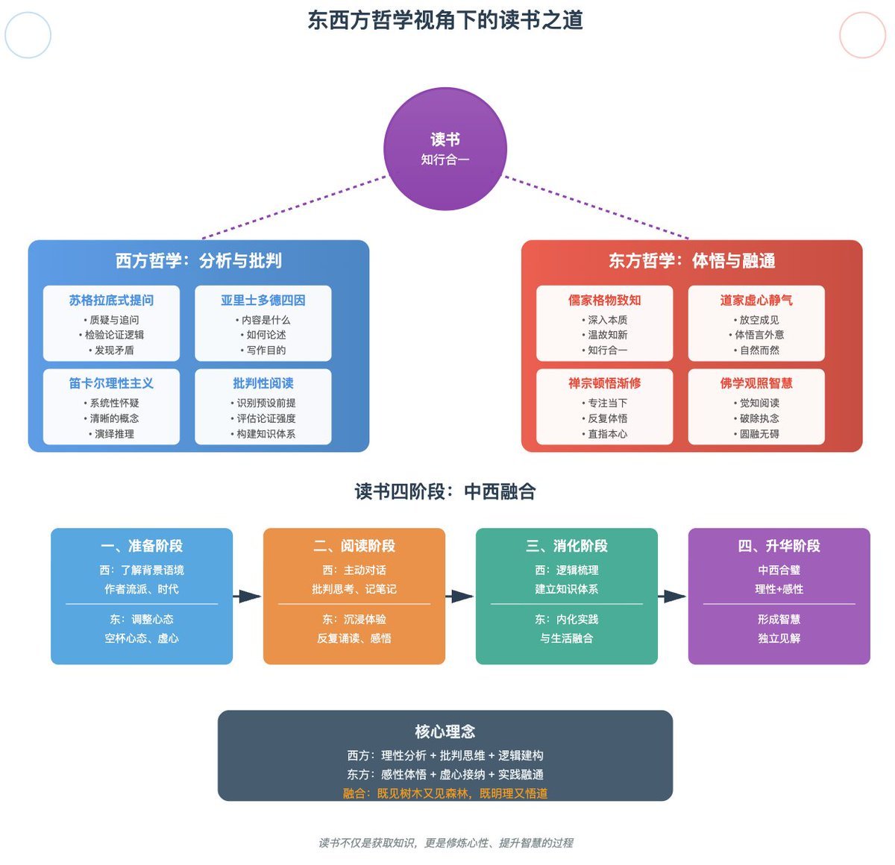

### 西方哲学传统：分析与批判

**1. 苏格拉底式提问（Socratic Method）**

- 对文本保持质疑态度
- 不断追问"为什么"
- 寻找论证的漏洞和前提假设

**2. 亚里士多德的四因说**

- 质料因：书的内容是什么？
- 形式因：如何组织论述？
- 动力因：作者为何写作？
- 目的因：要达到什么效果？

**3. 笛卡尔的理性主义**

- 系统性怀疑
- 建立清晰明确的概念
- 从简单到复杂的推理

### 东方哲学传统：体悟与融通

**1. 儒家的"格物致知"**

- 深入事物本质
- 反复涵泳，温故知新
- 知行合一，学以致用

**2. 道家的"虚心静气"**

- 放空成见，以虚待物
- 不执著于文字表面
- 体悟言外之意

**3. 禅宗的"顿悟渐修"**

- 专注当下的阅读体验
- 在反复阅读中突然贯通
- "不立文字，直指本心"

### 综合方法论

**准备阶段**

- 西方：了解作者背景、时代语境、学术流派
- 东方：调整心态，摒除杂念，培养"空杯心态"

**阅读阶段**

- 西方：主动对话，批判性思考，做笔记分析
- 东方：沉浸体验，反复诵读，感悟深意

**消化阶段**

- 西方：逻辑梳理，建立知识体系
- 东方：内化实践，与生活融合

**升华阶段**

- 中西合璧：既有理性分析，又有感性体悟
- 形成自己的见解和智慧

