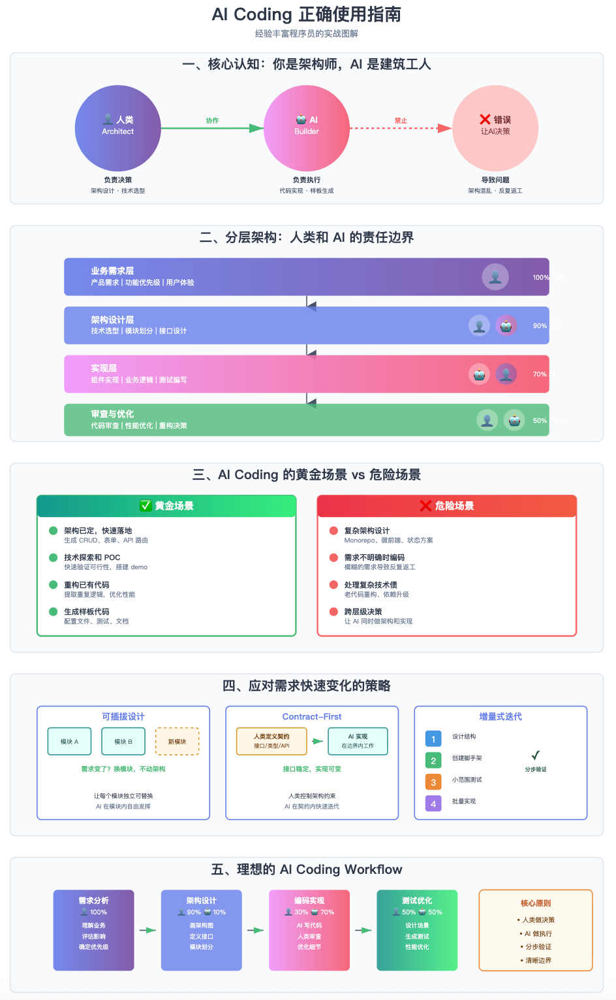

我用GitHub Copilot + Spec-Kit开发了一个前后端一体的monorepo项目，带前端、后端、blog子项目、数据库交互、mcp server、AI调用、共享组件库等，技术栈是next.js、nest.js、turbo、pnpm、ts、shadcn、tailwindcss、drizzle、ai-sdk、ai-elements、ollama、modelcontextprotocol/sdk等。到现在迭代6轮后，我心力交瘁，准备弃坑了，求大佬指点迷津，给我迷途小沙弥点亮下神灯

## 迭代过程

第一个迭代：搭建前后端基础+数据库postgres交互。Copilot如神助，Spec-Kit生成任务顺滑，代码一气呵成，感觉倍爽儿，我感觉自己御剑飞仙，驾驭AI了！纯AI驱动开发，零手动干预，项目瞬间起飞。😎

第二个迭代：接入本地Ollama服务、编写mcp server和Chatbot。需求清晰，AI迭代如丝般顺滑。数据库查询、API调用，一切OK。心想：NB啊，这么easy，之后可以给别人吹spec-kit了！

第三个迭代：使用Logto增加用户登录和鉴权管理。权限控制、登录逻辑，接入还算顺利

第四个迭代：感觉脑子开始抽筋了，功能还没实现完，开始升级构建了，next.js接入rspack优化打包

转折在第五个迭代：使用next.js的multi zone引入Blog子项目，并增加了共享组件库（packages目录）。架构升级，组件迁移、引用逻辑开始乱套。AI也有点迷糊了，删了我之前实现的部分代码！Task中的任务ID有重复，执行顺序也有问题了。我根据提示开始修Task顺序，结果布局样式跪了，未登录/登录的状态全坏。Analyze和Checklist后还狂问：性能优化、SEO、国际化要不要加？哥们，我特么都炸了，还让我加这些东西！需求变，架构变，Spec前后不一致，超前实现的功能现在变成累赘了。Spec-kit的哲学Human-in-the-loop的决策让我崩溃：正向补漏OK，反向删减也行，但正反拉扯，Workflow重来无数次。😩

第六个迭代：带着一堆Bug修Constitution，重启Workflow。拉扯太多，需求有点乱，架构也变复杂了。我在反复的clarity、分析Checklist，哪些提前做？哪些别做了？心力交瘁，快推进不下去了。纯Vibe Coding梦碎，准备上手手动改代码。😭

## 反思

核心认知：AI Coding ≠ 不用动脑  
经验丰富的程序员应该把 AI 当作高级助手而非架构师替代品。关键是要理解：  
AI 擅长的是"执行"，不是"决策"

AI Coding 不是让你不写代码，而是让你专注于更重要的事情：

✅ 架构设计  
✅ 产品思考  
✅ 性能优化  
✅ 代码审查  
✅ 技术决策

把重复的、机械的、规则明确的工作交给 AI。  
把创造性的、权衡性的、需要上下文的工作留给自己。

