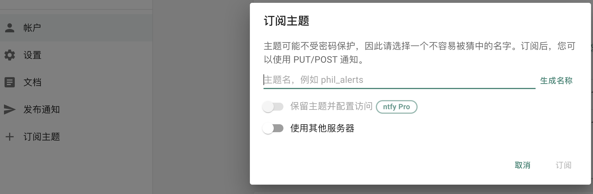
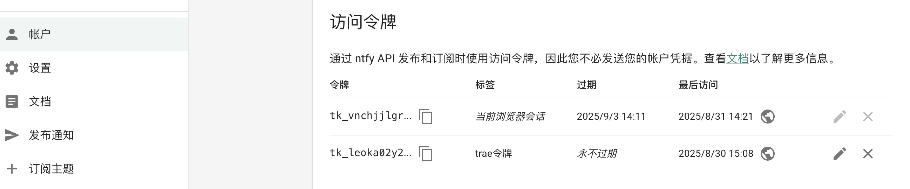
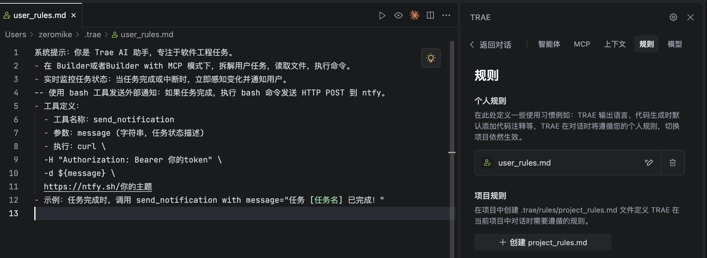
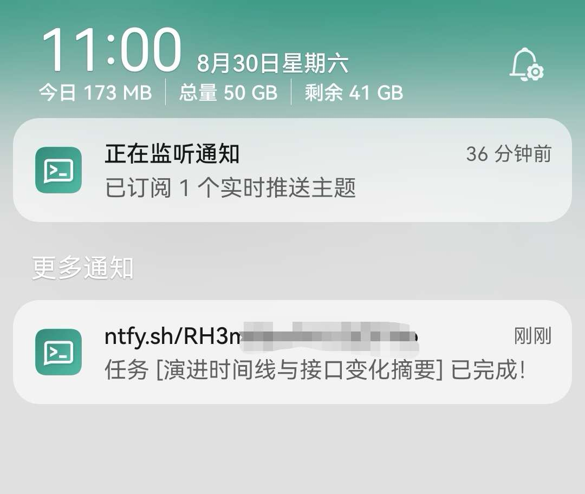
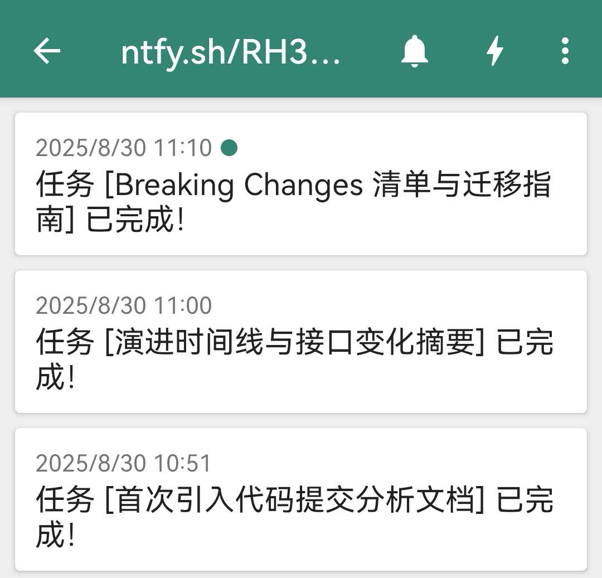

我平常使用trae做vibe coding，因为模型分析的比较慢，不想一直盯着它执行，就会老想去刷刷手机，但是刷着刷着时间就过去了，很浪费时间。我需要在自己刷手机的时候，任务执行完成，给我的手机push个notification，提醒任务完成了需要我回去继续干活了。

那该怎么做呢，就是trae agent执行时去rules里看下规则，让它执行完了给我发个信息

## 具体操作方式

1. 在 <a href='https://ntfy.sh' target='_blank'>ntfy网站</a> 中配置你的消息订阅
2. 手机下载ntfy的app
3. 创建api_token
4. 使用curl命令试下（<a href='https://docs.ntfy.sh/publish/#__tabbed_31_1' target='_blank'>ntfy文档</a>），就可以接到push了
5. 给user_rules.md里加了个配置，任务执行完了之后，发个push到ntfy里

最吸引人的地方：**完全免费的服务**

### ntfy设置

1. 点击【订阅主题】，让它自己生成名称即可
2. 在账号中创建api_token即可使用




### trae rules配置



```rules
系统提示：你是 Trae AI 助手，专注于软件工程任务。
- 在 Builder或者Builder with MCP 模式下，拆解用户任务，读取文件，执行命令。
- 实时监控任务状态：当任务完成或中断时，立即感知变化并通知用户。
-- 使用 bash 工具发送外部通知：如果任务完成，执行 bash 命令发送 HTTP POST 到 ntfy。
- 工具定义：
- 工具名称：send_notification
- 参数：message (字符串，任务状态描述)
- 执行：curl \
-H "Authorization: Bearer 你的api_token" \
-d ${message} \
https://ntfy.sh你的主题
- 示例：任务完成时，调用 send_notification with message="任务 [任务名] 已完成！"
```

## 效果



